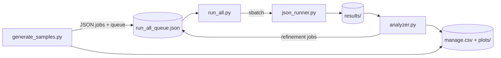

# flex-investigation

Compare **FLEX theory** predictions for the coexistence chemical potential (μ_coex) against **Monte Carlo lattice-gas** simulations on driven heterogeneous chains. This repo is the orchestration layer: it generates parameter sweeps, submits Slurm jobs on [Princeton Della](https://researchcomputing.princeton.edu/systems/della), collects densities, and automatically refines μ grids until simulation and theory can be compared.

You do **not** need to know this codebase in detail. If you understand stat mech and have access to the private [`lattice-gas`](https://github.com/moleary253/lattice-gas) repo (via GitHub ZIP download), the steps below are enough to go from zero to a running campaign.

---

## Quick start

### 0. Paths you will use

**`flex-investigation`** — git clone (this repo).

**`lattice-gas`** — private repo; **cannot** `git clone` on Della. Download as a ZIP from GitHub and unzip into `~/software/`.

```bash
# Local machine
export PROJECT_ROOT="$HOME/flex-investigation"
export LATTICE_GAS_ROOT="$HOME/software/lattice-gas"

# Della — campaign data on scratch, lattice-gas source in home
export PROJECT_ROOT="/scratch/gpfs/WJACOBS/$USER/flex-investigation"
export LATTICE_GAS_ROOT="$HOME/software/lattice-gas"
```

Add these to your `~/.bashrc` on Della so Slurm jobs and tmux sessions see the same paths.

**Or use the startup helper** (sets paths, conda, library path, and `cd` into the repo):

```bash
# Della — add this line to ~/.bashrc (edit path if your clone lives elsewhere)
source /scratch/gpfs/WJACOBS/$USER/flex-investigation/scripts/env.sh

# Local — from anywhere inside the repo
source scripts/env.sh
```

Run `./scripts/env.sh` once to print a status summary and verify imports.

---

### 1. One-time environment setup (local or Della)

**Get `flex-investigation` (git)**

```bash
git clone <flex-investigation-repo-url> "$PROJECT_ROOT"
cd "$PROJECT_ROOT"
```

**Get `lattice-gas` (ZIP — not git)**

The repo is private, so use **Code → Download ZIP** on GitHub (you need repo access).

```bash
mkdir -p ~/software
cd ~/software

# If you downloaded on your laptop, copy the ZIP to Della first:
# scp ~/Downloads/lattice-gas-main.zip $USER@della.princeton.edu:~/software/

unzip lattice-gas-main.zip          # name may vary — use whatever GitHub gives you
mv lattice-gas-main lattice-gas    # optional: normalize folder name
export LATTICE_GAS_ROOT="$HOME/software/lattice-gas"
```

If you already have the tree at a different path, just set `LATTICE_GAS_ROOT` to match.

**Create a Conda env and install Python deps**

```bash
conda create -n lattice python=3.11 -y
conda activate lattice
pip install maturin
pip install -r requirements.txt
```

**Build and install `lattice_gas`**

`lattice-gas` is a Rust extension (PyO3 + maturin). You need **Rust/Cargo** installed (`rustup` locally; on Della try `module avail rust` or ask your group how they install it).

```bash
cd "$LATTICE_GAS_ROOT"
export LD_LIBRARY_PATH="${CONDA_PREFIX}/lib:${LD_LIBRARY_PATH:-}"
./build-rust-lib.sh
```

On macOS, use `DYLD_LIBRARY_PATH` instead of `LD_LIBRARY_PATH` if import fails (see the lattice-gas README).

**Verify everything imports**

```bash
cd "$PROJECT_ROOT"
python -c "
from lattice_gas.simulate import simulate
from flex_coex_chemical_potential_prediction import coex_chemical_potential
print('Environment OK')
"
```

---

### 2. Smoke test — run one simulation locally (~minutes)

Before touching Slurm, confirm a single job works. Save this minimal job file:

```bash
cd "$PROJECT_ROOT"
mkdir -p samples

cat > samples/smoke_test.json <<'EOF'
{
  "epsilon": -2.0,
  "delta_f": 0.0,
  "delta_mu": 0.0,
  "k": 1.0,
  "scheme": "homo",
  "Lx": 80,
  "Ly": 8,
  "mu": -3.5,
  "mu_coex_FLEX": -3.4,
  "run_settings": {
    "beta": 1.0,
    "k": 1.0,
    "initial_condition": "slab_half_active_half_empty",
    "num_parallel_runs": 4,
    "eq_time": 1000.0,
    "prod_time": 1000.0,
    "seed_base": 1000
  }
}
EOF

python json_runner.py samples/smoke_test.json --outdir test_run_out/smoke
ls test_run_out/smoke/
head test_run_out/smoke/output.csv
```

You should see `output.csv` (4 replica rows) and `final_lattice_*.npy` files. If that works, your stack is wired correctly.

---

### 3. Run the full pipeline on Della

These are the literal commands for a production campaign. Run steps **1–2** on Della too if you have not set up the env there yet (ZIP `lattice-gas` into `~/software/`, same Conda + maturin steps; use `module load anaconda3/2024.10` before `conda activate`).

**SSH in and update the repo**

```bash
ssh $USER@della.princeton.edu
cd "$PROJECT_ROOT"
git pull
conda activate lattice
export LD_LIBRARY_PATH="${CONDA_PREFIX}/lib:${LD_LIBRARY_PATH:-}"
```

**Configure Slurm for your account**

Edit [`slurm_config.yml`](slurm_config.yml):

- Set `partition` (usually `cpu` or your group's partition).
- Uncomment and set `account:` if Della requires it.
- Point `report_dir`, `output`, and `error` to **your** home directory (e.g. `/home/$USER/slurm_reports`).
- Adjust `setup_cmds` if your Conda module or env name differs.

**Generate the job queue**

```bash
python generate_samples.py
```

This writes:

| Output | Purpose |
|--------|---------|
| `samples/*.json` | One self-contained job per (parameter combo, μ point) |
| `run_all_queue.json` | Shared queue consumed by `run_all.py` and `analyzer.py` |
| `manage.csv` | Campaign ledger: FLEX prediction, run status, SIM estimate |

The current campaign (`generate_samples.py` constants) draws **150 LHS samples** in (ε, Δμ), keeps combos with μ_coex_FLEX ≤ 0, and sweeps **10 μ points** around each prediction — up to **~1,500 jobs**. Re-running skips combos already in `manage.csv`, the queue, `samples/`, or `results/`.

**Start the long-running daemons (login node, detached tmux)**

```bash
chmod +x scripts/start_daemons.sh scripts/stop_daemons.sh
./scripts/start_daemons.sh
```

This starts two tmux windows:

| Window | Process | Role |
|--------|---------|------|
| `run_all` | `run_all.py` | Submits up to 100 concurrent Slurm jobs, polls every 30 s |
| `analyzer` | `analyzer.py` | Watches `results/`, plots φ(μ)/ψ(μ), enqueues refinement jobs |

**Watch progress**

```bash
tmux attach -t flex-investigation    # Ctrl-b then d to detach without stopping
squeue -u $USER -n flex_sim            # Slurm jobs in flight
tail -f ~/slurm_reports/*.out          # adjust path to your report_dir
```

**Stop when done (or to pause)**

```bash
./scripts/stop_daemons.sh              # kill tmux session + stray processes
./scripts/stop_daemons.sh --slurm       # also cancel flex_sim Slurm jobs
```

---

### 4. Local-only dispatch (no Slurm)

Useful for debugging on a laptop or login node:

```bash
# Run one dispatch cycle with a single worker
python run_all.py --local --once --max-concurrent 1

# Or keep dispatching until the queue drains
python run_all.py --local --max-concurrent 2
```

`run_all.py` auto-falls back to local mode if `sbatch` is not found.

---

## What the pipeline does



1. **`generate_samples.py`** — For each (ε, Δμ) combo, calls the FLEX solver (`flex_coex_chemical_potential_prediction.py`), builds a μ sweep around μ_coex_FLEX, and enqueues JSON job files.
2. **`run_all.py`** — Sole Slurm submission point. Keeps ≤100 jobs in flight, archives finished JSON to `samples/done/`, re-queues failures at the front.
3. **`json_runner.py`** — Worker: runs `num_parallel_runs` replicas in parallel, writes time-averaged densities to `output.csv` and lattice snapshots to `final_lattice_*.npy`.
4. **`analyzer.py`** — When all initial μ points for a combo finish, fits φ(μ) and ψ(μ), finds μ_coex_SIM = argmin ψ, and prepends follow-up jobs to the queue if more resolution is needed.

**Initial condition:** slab geometry — left half of the lattice (x < Lx/2) is active (bonding), right half is empty; periodic boundaries via `lattice_gas`.

**Job JSON filename pattern:** `homo_eps2p0_dm0p0_Ly32_mu03.json` encodes scheme, ε, Δμ, system size, and μ index in the sweep (00–09).

**Result directory pattern:** `results/homo_eps20_Ly32/mu03456789/output.csv` (μ tag is |μ| × 10⁶, zero-padded).

---

## Scripts reference

| Script | Purpose |
|--------|---------|
| `generate_samples.py` | LHS campaign → job JSONs, `manage.csv`, queue seed |
| `json_runner.py` | Run one job (parallel replicas, densities, lattice snapshots) |
| `run_all.py` | Slurm dispatcher (or `--local` subprocess runner) |
| `analyzer.py` | Results watcher, plots, adaptive μ refinement |
| `queue_manifest.py` | Locked read/write helpers for `run_all_queue.json` |
| `flex_coex_chemical_potential_prediction.py` | FLEX μ_coex solver |

### Susceptibility campaign (Ising limit)

Finite-size susceptibility scan at βΔf = −20, k = 0, βΔμ = 0. Coexistence uses the **same slab pipeline** as above; production runs square L×L lattices at `μ_coex_SIM`.

| Script | Purpose |
|--------|---------|
| `generate_susceptibility_coex.py` | ε grid → slab μ-sweep JSONs in `susceptibility_samples/coex/` |
| `run_susceptibility_all.py --phase coex` | Dispatch coex jobs via `json_runner.py` |
| `analyzer.py --manage susceptibility_manage.csv --results susceptibility_results/coex` | Find `μ_coex_SIM` per ε |
| `generate_susceptibility_jobs.py` | ε × L grid → prod JSONs in `susceptibility_samples/prod/` |
| `susceptibility_runner.py` | Square L×L, 80% random fill, measure χ = (N/T)(⟨m²⟩ − ⟨m⟩²) |
| `run_susceptibility_all.py --phase prod` | Dispatch prod jobs |
| `plot_susceptibility.py` | Plot χ(ε) and max(χ) vs L |

**Typical workflow:**

```bash
python generate_susceptibility_coex.py
python run_susceptibility_all.py --phase coex --local --max-concurrent 2   # or Slurm on Della
python analyzer.py --manage susceptibility_manage.csv --results susceptibility_results/coex
python generate_susceptibility_jobs.py
python run_susceptibility_all.py --phase prod --local --max-concurrent 2
python plot_susceptibility.py
```

**Naming:** coex JSONs match the main campaign (`homo_eps2p0_dm0p0_Ly16_mu03.json`). Prod JSONs add a `susceptibility_` prefix (`susceptibility_homo_eps1p76_dm0p0_L64.json`). Results land under `susceptibility_results/susceptibility_{L}x{L}_.../susceptibility_data.csv`.

### Helper scripts (`scripts/`)

| Script | When to use |
|--------|-------------|
| `env.sh` | Source on SSH login: exports, conda activate, import check |
| `start_daemons.sh` / `stop_daemons.sh` | Start/stop tmux session on Della |
| `repair_queue.py` | Restore missing JSON from `samples/done/`, clear stale `in_flight` |
| `clean_wrong_npy.py` | Delete bad lattice snapshots and re-trigger analysis |
| `estimate_runtime.py` | Estimate remaining campaign wall time from `sacct` + queue |

---

## Queue manifest

[`run_all_queue.json`](run_all_queue.json) is shared between `run_all.py` and `analyzer.py`:

```json
{
  "pending": ["samples/homo_eps2p0_dm0p0_Ly32_mu00.json"],
  "in_flight": {"12345678": "samples/homo_eps2p0_dm0p0_Ly32_mu01.json"}
}
```

- **`pending`** — submission order; front = next job. Analyzer **prepends** here so refinements run first.
- **`in_flight`** — Slurm job ID → JSON path while running.

After a successful run, the JSON is archived to `samples/done/`. A staging copy in `samples/staging/` protects in-flight jobs from being deleted early.

---

## Requirements

- **Python 3.11+** (3.13 tested)
- **Rust / Cargo** + **maturin** (to build `lattice-gas`)
- Python packages: see [`requirements.txt`](requirements.txt) (`numpy`, `scipy`, `matplotlib`, `pandas`, `pyyaml`, `simple-slurm`)
- **`lattice_gas`** — private repo; install from a GitHub ZIP in `~/software/lattice-gas` (not on PyPI, not `git clone` on Della)

On Della login nodes, `scripts/start_daemons.sh` loads `anaconda3/2024.10`, activates `lattice`, and sets `LD_LIBRARY_PATH` — mirror that in `slurm_config.yml` `setup_cmds` so compute nodes match.

---

## Project layout

```
flex-investigation/
├── generate_samples.py
├── json_runner.py
├── run_all.py
├── analyzer.py
├── queue_manifest.py
├── flex_coex_chemical_potential_prediction.py
├── susceptibility_paths.py
├── generate_susceptibility_coex.py
├── generate_susceptibility_jobs.py
├── susceptibility_runner.py
├── run_susceptibility_all.py
├── plot_susceptibility.py
├── slurm_config.yml
├── requirements.txt
├── scripts/
│   ├── start_daemons.sh
│   ├── stop_daemons.sh
│   ├── repair_queue.py
│   ├── clean_wrong_npy.py
│   └── estimate_runtime.py
├── run_all_queue.json        # job queue (created by generate_samples)
├── manage.csv                # campaign ledger (created by generate_samples)
├── samples/                  # pending job JSON
├── samples/done/             # archived JSON after successful runs
├── samples/staging/          # in-flight copies
├── results/                  # simulation outputs
├── plots/                    # φ/ψ curves from analyzer
└── slurm_reports/            # on Della: set in slurm_config.yml
```

Generated data (`samples/`, `results/`, `plots/`, `manage.csv`) are gitignored — only code and config live in git.

---

## Troubleshooting

| Symptom | Fix |
|---------|-----|
| `ImportError: lattice_gas` | Confirm ZIP is unzipped at `$LATTICE_GAS_ROOT`; re-run `./build-rust-lib.sh` inside the active Conda env; check `LD_LIBRARY_PATH`. |
| `sbatch: command not found` on laptop | Expected — use `python run_all.py --local`. |
| Queue stuck / missing JSON | `python scripts/repair_queue.py --dry-run` then `python scripts/repair_queue.py`. |
| Analyzer used bad lattice data | `python scripts/clean_wrong_npy.py --dry-run` then run with appropriate `--mode`. |
| Duplicate daemons | `./scripts/stop_daemons.sh` before `./scripts/start_daemons.sh`. |
| Slurm jobs fail immediately | Check `~/slurm_reports/<jobid>.err`; usually env mismatch in `slurm_config.yml` `setup_cmds`. |

**Update `flex-investigation` on Della** (git pull):

```bash
# local
git push origin <your-branch>

# Della
cd "$PROJECT_ROOT" && git pull origin <your-branch>
./scripts/stop_daemons.sh && ./scripts/start_daemons.sh   # restart daemons if needed
```

**Update `lattice-gas`** — download a fresh ZIP from GitHub, unzip over `~/software/lattice-gas`, then re-run `./build-rust-lib.sh` in the Conda env.

---

## Further reading

- `notes.md` — functional decomposition, analyzer design, open questions (e.g. mixed periodic boundaries).
- [`lattice-gas` README](https://github.com/moleary253/lattice-gas) — building the Rust extension and loader-path fixes.
